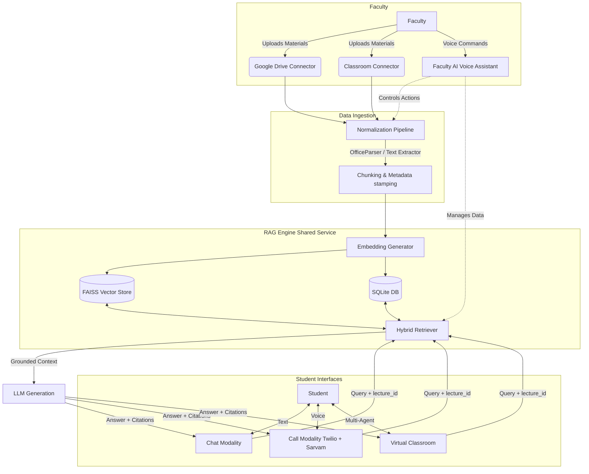

# OneStop: Academic AI Workspace

OneStop is an advanced academic workspace prototype built for modern educational institutions. It empowers faculty to seamlessly integrate their existing digital materials and provides students with a highly focused, strictly grounded AI assistant.

Unlike generic LLM wrappers, OneStop operates on a **strict lecture-bound retrieval architecture**. When a student asks a question—whether via text chat or voice call—the AI answers using *only* the specific context of that exact lecture. This design radically minimizes hallucinations and guarantees robust source traceability.

---

## 🏗 System Architecture



The repository is structured into distinct, composable layers rather than a monolith.

### 1. Faculty Connectors & Ingestion (`lib/connectors`)
Faculty members connect external systems where their teaching materials live and manage their workflows.
- **Connectors**: Pluggable integrations for Google Drive, Google Classroom, and direct uploads.
- **Normalization Pipeline**: Ingests PDFs, slides, assignments, and transcripts, breaking them down into uniform text chunks using libraries like `officeparser`.
- **Faculty AI Voice Assistant (Under Development)**: A comprehensive, voice-driven control center. By tapping the assistant orb and speaking naturally, faculty can execute virtually *any* action across the entire OneStop system—from managing courses and syncing materials to controlling administrative workflows.

### 2. The Retrieval-Augmented Generation (RAG) Engine (`lib/rag`)
The central nervous system of OneStop. It is a shared service utilized by all student-facing features.
- **Embedding & Indexing**: Converts text chunks into vector embeddings and indexes them using FAISS (`lib/rag/faiss.ts`).
- **Hybrid Retrieval**: Combines dense vector search with metadata filtering (`lib/rag/hybrid.ts`).
- **Mandatory Metadata**: Every chunk is permanently stamped with metadata (`course_id`, `lecture_id`, `faculty_id`) to ensure retrieval never leaks across unrelated lectures.

### 3. Student Experience Orchestration
Students interact with the grounded RAG service through multiple modalities:
- **Chat Modality (`app/page.tsx - ChatView`)**: Standard text-based interaction returning transparent citations pointing directly to the exact source document and section.
- **Call Modality (`lib/call`)**: Real-time voice interaction.
  - **Twilio**: Handles the telephony transport, enabling inbound/outbound phone calls (`lib/call/twilio.ts`).
  - **Sarvam SDK**: Powers high-fidelity Indian-language-optimized Speech-to-Text (STT) and Text-to-Speech (TTS) (`lib/call/sarvam.ts`).
- **Virtual Classroom**: (Currently under development) A collaborative, multi-agent orchestration experience simulating live environments.

---

## 📂 Project Structure

```text
one-stop/
├── app/
│   ├── api/
│   │   ├── academic/     # API routes for modules, doubts, subjects
│   │   └── call/         # Webhooks & endpoints for Twilio & Sarvam orchestration
│   ├── page.tsx          # Main React Application UI (Dashboard, Chat, Connectors, Call)
│   └── globals.css       # Tailwind v4 theme and custom UI animations
├── lib/
│   ├── academic/         # Core domain logic (types, validation, sqlite repository)
│   ├── call/             # Voice orchestration (Twilio config, Sarvam SDK wrap, Wav parsing)
│   ├── connectors/       # Third-party integrations (Google Drive, Classroom)
│   └── rag/              # Shared knowledge system (FAISS, Hybrid Search, Embeddings)
├── data/
│   └── rag/              # Local storage for SQLite DBs and FAISS indices
└── package.json
```

---

## 🚀 Tech Stack

* **Framework:** [Next.js 16.3](https://nextjs.org/) (App Router)
* **UI/View:** React 19, [Tailwind CSS v4](https://tailwindcss.com/), Shadcn, Lucide React
* **AI & Voice:** [Sarvam AI SDK](https://www.sarvam.ai/), Twilio
* **Vector Store / DB:** FAISS (Local flat indexing), SQLite (`better-sqlite3`)
* **Language:** TypeScript

---

## 🛠 Setup & Installation

### Prerequisites
- Node.js (v20+)
- Python (for FAISS environment if using Python bindings, though pure JS/WASM fallbacks are often used)
- A Twilio Account (for telephony features)
- A Sarvam AI API Key (for voice/audio features)

### 1. Install Dependencies
```bash
npm install
# or
pnpm install
```

### 2. Configure Environment Variables
Copy the example environment file and populate your credentials.
```bash
cp .env.example .env
```

**Key `.env` variables required:**
- `PUBLIC_APP_URL`: Your ngrok or production URL (critical for Twilio webhooks).
- `TWILIO_ACCOUNT_SID`, `TWILIO_AUTH_TOKEN`, `TWILIO_PHONE_NUMBER`: Twilio credentials.
- `SARVAM_API_KEY`: Authentication for STT/TTS.
- `SARVAM_TTS_MODEL`, `SARVAM_STT_MODEL`: (e.g., `bulbul:v3`, `saaras:v4`).

### 3. Run the Development Server
```bash
npm run dev
```
Open [http://localhost:3000](http://localhost:3000) to view the application.

---

## 📜 Development Guidelines & Principles

Contributors and autonomous AI agents working in this repository MUST adhere to the following rules:

1. **The Prime Directive:** **All student-facing AI responses must be grounded in the selected lecture context first.** Do not build features that treat the database as a single flat "RAG model". It is a highly segmented *RAG System*.
2. **Metadata is Mandatory:** Fields like `course_id`, `lecture_id`, and `source_name` are not optional decorations. They are structurally required for accurate filtering and permissions.
3. **DRY Retrieval:** Do not build duplicate retrieval logic for the Chat view and the Call view. Both must call the shared `lib/rag` service. The only difference should be the orchestration/presentation layer.
4. **Source Trust:** Responses should expose enough source information for absolute student trust. If an answer cannot cite a specific lecture chunk, the system must gracefully fallback or decline.

> **Note to AI Agents:** If you are tasked with modifying student-AI interaction flows, explicitly verify that your implementation accurately passes and enforces the `activeContext.lectureId` parameter to the backend.
